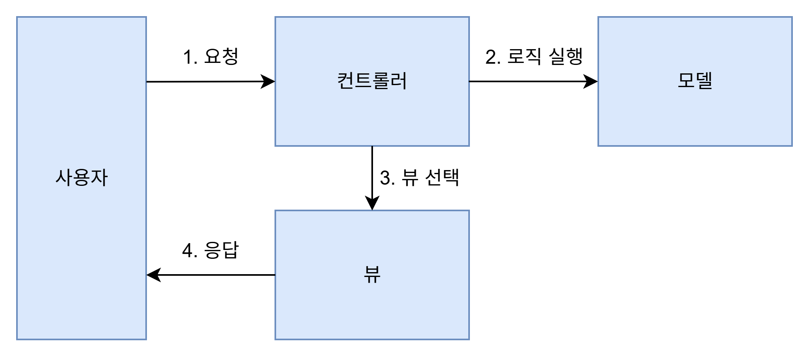

# 1. MVC 패턴 (Model-View-Controller)

### 🐧 정의

> MVC 패턴은 애플리케이션을 Model, View, Controller의 3가지 역할로 분리하여 유지보수성과 확장성을 높이기 위한 소프트웨어 아키텍처 패턴이다.
> 
- 모델 : 회원 가입, 암호 변경 등 비즈니스 영역의 로직을 처리한다.
- 뷰 : 사용자가 보게 될 결과를 생성해서 사용자에 응답한다.
- 컨트롤러 : 사용자의 입력 처리와 흐름 제어를 담당한다.
    

### 📌 특징

- 역할 분리로 인해 유지보수 및 테스트 용이
- 재사용성 높음
- 변경에 강함

# 2. 계층형 아키텍처

### 🐧 정의

> 계층형 아키텍처는 소프트웨어 시스템을 기능별로 수직 계층으로 분리하여 구성하는 구조이다.
각 계층은 자신의 하위 계층만을 호출하며, 상위 계층에 대해선 독립적으로 동작한다.
> 
- 가장 널리 쓰이는 아키텍처 패턴
- 시스템을 관심사에 따라 논리적으로 나누고 유지보수를 용이하게 함
- 계층 구조 (4계층)
    
    
    | 계층 |  | 역할 |
    | --- | --- | --- |
    | 표현(또는 UI) | Presentation Layer (UI) | 사용자 인터페이스 처리<br>화면 표시, 입력 수신 |
    | 응용 | Application Layer (Service) | 사용자 요청 처리<br>비즈니스 로직 흐름 제어 |
    | 도메인(또는 모델) | Domain Layer (Business Logic) | 핵심 비즈니스 규칙과 도메인 처리 |
    | 인프라(또는 영속) | Infrastructure Layer (Persistence) | DB, 파일, 네트워크 등 외부 자원 처리 |

### 📌 특징

- 구조가 단순하고 규칙이 명확해 코드 실행 흐름을 추적하기 쉬움
- 3계층으로 단순화하는 경우 도메인 로직이 인프라와 응용 계층으로 분산되어 코드 유지보수를 어렵게 만듦

# 3. DDD와 전술 패턴

### 🐧 정의

> 도메인 주도 설계(DDD)는 복잡한 소프트웨어를 개발할 때, 도메인(비즈니스의 핵심 개념과 규칙)에 집중하고 도메인 전문가와의 협업을 통해 모델을 명확히 정의하여 시스템을 설계하는 방법론이다.
> 
- 기술보다 비즈니스에 초점을 맞춘 설계방식
- 복잡한 요구사항을 도메인 모델 중심으로 분할하고 표현
- DDD에서 도메인 모델의 구성요소
    
    
    | 구성 요소 | 설명 |
    | --- | --- |
    | 엔티티<br>(Entity) | 각 엔티티 객체는 고유의 식별자를 가지며, 각 엔티티는 식별자로 구분된다. 내부 상태가 바뀌어도 식별자는 바뀌지 않는다. 예를 들어 각 주문 엔티티는 서로 다른 주문번호를 식별자로 갖는다. |
    | 밸류<br>(Value) | 밸류는 고유의 식별자를 갖지 않으며 개념적인 값을 표현한다. 금액, 배송 주소 같은 값이 밸류가 된다. 값은 불변으로 구현하는 것을 추천한다. |
    | 애그리거트<br>(Aggregate) | 애그리커트는 관련된 객체를 묶어 하나의 개념적인 단위를 표현한다. 예를 들어 주문 애그리거트는 Order 엔티티, OrderLine 밸류 집합, ShippingAddress 밸류로 구성될 수 있다. 애그리커트는 모델의 일관성을 관리하는 단위가 된다. |
    | 리포지토리<br>(Repository) | 도메인 객체를 물리적인 저장소와 연결할 때 사용하는 모델이 리포지토리이다. 리포지토리는 도메인 객체를 저장하고 조회할 때 사용되는 인터페이스를 제공한다. 리포지토리는 애그리거트 단위로 존재한다. |
    | 도메인 서비스<br>(Domain Service) | 특정한 애그리거트에 속하지 않은 로직을 구현한다. 외부 연동이 필요한 도메인 로직도 도메인 서비스로 사용해서 표현한다. |
    | 도메인 이벤트<br>(Domain Event) | 도메인 내에서 발생한 이벤트를 표현한다. 도메인의 상태가 변경될 때 도메인 이벤트가 발생한다. 도메인 이벤트는 주로 다른 부분에 변화를 알리기 위해 사용된다. |

### 📌 특징

- 도메인 중심 설계로 복잡한 비즈니스 로직을 명확하게 표현할 수 있음
- 도메인 개념(엔티티, 밸류, 서비스 등)에 따라 코드 구조를 나누어 유지보수 용이

# 4. 마이크로서비스 아키텍처

### 🐧 정의

> 마이크로서비스 아키텍처(MSA)는 애플리케이션을 작고 독립적인 서비스들로 나누어 구성하는 아키텍처 스타일이다.
각 서비스는 하나의 도메인(기능)을 담당하며 독립적으로 개발, 배포, 확장이 가능하다.
> 
- 예시 구조
    
    ```less
    [ 사용자 ]
        |
    [ API Gateway ]
     ┌──────┬────────┬────────┐
     │      │        │        │
     ▼      ▼        ▼        ▼
    Auth  Product  Order   Payment  (각각 마이크로서비스)
    ```
    
- 각 서비스는 별도의 프로세스로 동작하고, 보통 REST API, 메시지 큐 등을 통해 통신함
- 모놀리식 아키텍처와 대비되는 개념
    - 모놀리식 vs MSA 비교
        
        
        |  | 모놀리식 | 마이크로서비스 |
        | --- | --- | --- |
        | 장점 | - 배포가 단순하다.<br>- 코드 관리가 더 쉽다.<br>- 성능을 높이기 위해 복잡한 구조를 가질 필요가 없다.<br>- 테스트와 디버깅이 쉽다. | - 독립적인 배포와 지속적인 배포가 용이하다.<br>- 성능 확장이 용이하다.<br>- 기술에 대한 유연성을 가질 수 있다.<br>- (보통) 개발자의 만족도가 더 높다. |
        | 단점 | - 규모가 커질수록 개발 속도가 느려질 수 있다.<br>- 한 기능의 문제가 전체에 영향을 줄 수 있다.<br>- 구현 기술 변경에 어려움이 있다.<br>- 작은 변경도 전체를 다시 배포해야 한다. | - 테스트와 디버깅이 어려울 수 있다.<br>- 모놀리식 대비 인프라가 복잡해진다.<br>- 소통에 따른 부하가 증가할 수 있다.<br>- 무분별하게 서비스를 만들면 분산 모놀리식이 될 수 있다. |
- 마이크로서비스 6가지 핵심 개념
    1. 독립적 배포 : 다른 마이크로서비스를 배포하지 않고도 마이크로서비스를 변경, 배포, 출시할 수 있어야한다.
    2. 도메인을 중심으로 모델링 : 각 마이크로 서비스는 도메인을 기준으로 구분해야 한다. 한 도메인의 기능 구현이 여러 마이크로서비스에 걸쳐 있으면 출시 비용이 증가한다.
    3. 자신의 상태를 가짐 : 마이크로서비스는

### 📌 특징

- 기능별로 서비스를 분리하여 독립적인 개발과 배포 가능
- 한 서비스에 장애가 생겨도 전체 시스템에 영향 최소화
- 서비스마다 독립적인 기술 스택 선택 가능 (언어, DB 등)
- 작은 팀 단위로 병렬 개발이 용이하여 대규모 조직에 적합
- 서비스 간 통신(네트워크, 인증 등) 복잡도가 높음

# 5. 이벤트 기반 아키텍처

### 🐧 정의

> 이벤트 기반 아키텍처는 두 시스템 간에 통신할 때 이벤트를 사용하는 구조로,
한 시스템이 이벤트를 발생시키면, 다른 시스템은 그 이벤트를 받아 필요한 작업을 수행하는 방식이다.
> 
- 주요 구성 요소
    
    
    | 구성 요소 | 설명 |
    | --- | --- |
    | 이벤트 생산자 | 이벤트를 발생시키는 시스템 |
    | 이벤트 소비자 | 이벤트를 구독하여 처리하는 시스템 |
    | 이벤트 브로커<br>(또는 라우터) | 이벤트를 생산자와 소비자 사이에서 중계하거나 라우팅하는 역할(예: Kafka, RabbitMQ) |
- 이벤트란 : “무언가 일어났다”는 사실의 표현 (예: `주문함` , `주문을 취소함` )
- 이벤트를 발행(Publish)한 서비스는 결과를 기다리지 않고 즉시 다음 작업 수행 가능
- 이벤트를 구독(Subscribe)한 서비스가 이를 감지해 필요한 처리를 수행

### 📌 특징

- 비동기 처리로 인해 시스템 응답성이 높고, 느슨하게 결합된 구조를 가짐
- 서비스 간 의존도를 줄일 수 있어 확장성과 유연성이 높음
- 이벤트 흐림이 명시적으로 표현되지 않으면 추적/디버깅이 어려울 수 있음
- 재시도, 중복 이벤트 처리 등 추가적인 고려 필요

# 6. CQRS

### 🐧 정의

> CQRS 패턴은 시스템에서 **조회(Query)**와 **명령(Command)** 책임을 분리하여 처리하는 아키텍처 패턴이다.
즉, 데이터를 조회하는 작업과 데이터를 변경하는 작업을 각각 다른 모델과 경로로 설계한다.
> 

### 📌 특징

- 읽기와 쓰기 로직을 분리하여 복잡한 도메인 로직을 명확하게 표현할 수 있음
- **쓰기(Command)**는 상태를 변경하지만 결과를 반환하지 않음
(예: “사용자 등록”, “주문 생성”)
- **읽기(Query)**는 상태를 변경하지 않고 데이터를 반환함
(예: “사용자 목록 조회”, “상품 상세 조회”)
- 읽기/쓰기 각각의 성능 요구사항에 맞춰 별도 최적화 가능
- **장단점**
    | 장점 | - 복잡한 비즈니스 도메인을 명확히 분리<br>- 읽기와 쓰기를 독립적으로 확장 가능<br>- 읽기 쿼리 성능 개선에 유리 (캐시, 조회 전용 DB 등 도입 쉬움) |
    | --- | --- |
    | 단점 | - 구조가 복잡해지고 초기 설계 비용이 높음<br>- 읽기/쓰기 모델 간 동기화 문제를 별도로 해결해야 함- 단순한 CURD 애플리케이션에는 과한 설계일 수 있음 |